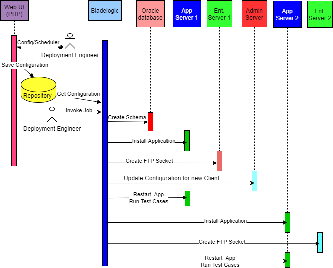

##**OneClick**
#### Description

A request comes from business manager to deploy a retailer's instance to process financial transactions. A resource will be allocated to implement the solution. The resource has to gather configuration details before implementing the solution first in QA, then Preproduction and finally to Production. A typically turnaround expected was 3 weeks.

**Development and Deployment was completed in 6 weeks.**

###### End Results
1. Reduced deployment time to 16-man hours from 80-man hours.
2. Loosely tied to tools like Bladelogic
3. Migrated off from Bladelogic to Ansible in less than 4 hours.

###### The Process
1. Request Validations team to allocate server port (Unix Service Port), UID, GID, and Cloud UID to store transactional data.
2. Request Database team to create database schema in QA environment.
3. Verify database connectivity before start installation in QA.
4. Once database schema was ready, create user/group on two vms (Clustered with Leg1 and Leg2).
5. Follow manual steps to pull images, untar, update configuration files, and start the process on leg1.
6. Login to enterprise server to create custom Sockets to communicate with other components. Repeat the same process on second (redundant) enterprise server.
7. Login to Admin server to update configuration for the new client.
8. Run test scripts to make sure that the components were working. 
9. Restart client's instance to make sure all configurations were udpated and in affect.
10. Repeat steps 4 to 9 for Leg 2.
11. Once QA Validation is done, then repeat steps from 1 to 10 for Preproduction and Production environments.

All this process takes about 80 man hours.

###### The Task
1. Reduce turnaround time by 50%
2. Eliminate human errors to the extent possibe.

###### The Team
1. Self (Lead Developer)
2. Database administrator
3. One Deployment Engineer
4. Two testers

###### The Strategy
1. Use existing infrastructure (Bladeogic tool)
2. Use Perl (Some systems were running on Redhat 4, and Python was 2.4, and did not want to upgrade Python as it might break ***yum*** )
3. Came to an understanding with DBA team that the process creates database schema, but if we need to delete, raise a ticket to DBA team. Rest of the uninstall process should be automated.
4. As it involves multiple machines and tasks were to execute sequentially, use a central repository server to track the progress, and perform rollback if any step fails. 
5. The process should be idempotent.
6. Physical "login" to hosts must be elimiated.
7. Provide an interface to populate custom values and schedule/unschedule "install" or "rollback" operations.

###### The Big Picture

###### The Implementation
1. About 6000 lines of code written in Perl
2. Used **Bladelogic** to orchestrate the process across multiple machines
3. 

