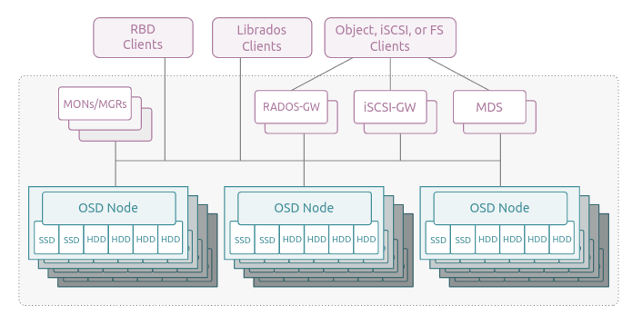

##### CEPH

1. Servers should be n the same network
2. configure /etc/hosts
3. enable no-subscription repository for proxmox
4. update packages
5. Create proxmox cluster (pvecm create <clustername>)
6. Add the rest of the servers to the cluster
7. install ceph packages on all servers (pveceph install)
8. Generate initial ceph.conf on one of the servers in the cluster (pveceph init -network 10.10.10.0/24)
9. Create monitors on all three servers (pveceph createmon)
10. Creates OSDs (pveceph createosd </dev/devname>) for each physical harddisk
11. Create pool 
12. Cannot use to store images

CRUSH Algorithm

###### AWS S3 Storage vs CEPH
Ref: https://www.lightbitslabs.com/blog/ceph-storage/#ceph-vs-aws-s3
Operated under the LGPL 2.1 license, the Ceph Object Gateway daemon (released in 2006) offers two different sets of APIs-

1. One that is compatible with a subset of the Amazon S3 RESTful APIs
2. Second, which is compatible with a subset of the OpenStack Swift API.

One of the key differences between S3 and Ceph Storage is that while Amazon S3 is a proprietary solution available only on Amazon commercial public cloud (AWS), Ceph is an open-source product that can be easily installed on-premises as a part of a private cloud.

Another difference between the two is that Ceph provides strong consistency, which means that a new object and changes to an object are guaranteed to be visible to all of the clients. On the contrary, Amazon S3 offers read-after-write consistency for creating new objects and eventual consistency for both updating and deleting objects.

###### Why is Ceph Storage Not Enough for Modern Workloads?
Ref: https://www.lightbitslabs.com/blog/ceph-storage/
While there is no denying the fact that Ceph storage is highly scalable and a one-size-fits-all solution, it has some inherent architectural loopholes, mainly because it was not created for today’s fast storage media–NAND flash and NVMe® flash.

Ceph storage is not suitable for modern workloads for the following reasons:

1. Enterprises either working with the public cloud, using their own private cloud or moving to modern applications require low latency and consistent response times. While BlueStore (a back-end object store for Ceph OSDs) helps to improve average and tail latency to an extent, it cannot necessarily take advantage of the benefits of NVMe® flash.

2. Modern workloads typically deploy local flash, (local NVMe® flash), on bare metal to get the best possible performance and Ceph is not equipped to realize the optimized performance of this new media. In fact, Ceph in a Kubernetes environment where local flash is recommended, can be an order of magnitude slower than local flash.

3. Ceph has a comparatively poor flash utilization (15-25%). In case of a failure with Ceph or the host, the rebuild time for shared storage needs can be very slow because of massive traffic going over the network for a long period.