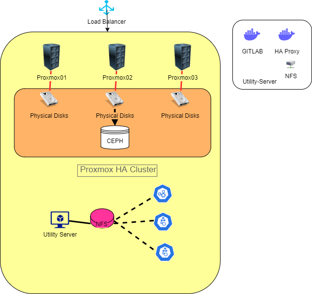

1. For high performance int Virtualization
   -> Use RAW format for VM images (Qemu - COW/COW2 [Copy on Write])
   -> User "writeback" caching mode for virtual images
2. git config --global credential.helper 'store --file ~/.my-credentials' (On linux to store git credentials)
3. 

4. Terraform is not a configuration management tool, it’s a provisioning tool. The distinction is
subtle but important. Configuration management tools, like Chef, Puppet, Ansible and
SaltStack, are designed to install and manage software on existing servers. They measure
drift and restore the software installed on servers to desired states. This works fine if your
technology stack is made up only of servers and those servers are already running, but it
doesn’t help you with the initial provisioning process.

Mutable infrastructure is when you run software updates on a server and make changes in
place. Immutable infrastructure on the other hand, means you cannot make changes in place,
and any changes you do make are destructive operations. For example, if you have to make
changes to an immutable server managed by Terraform, first Terraform would first kill the old
server and then deploy a new one perfectly configured the way you want. Mutable
infrastructure is like fixing an old toy to do what you want, whereas immutable infrastructure
is like buying a new toy that already has all the features you want and throwing the old one
away. Immutable infrastructure is inspired by functional programming and is popular because
it’s easier to reason about what’s deployed when things aren’t changing. If you try to combine
mutable and immutable paradigms then you’re in for a bad time, because you’re forgoing the
benefits of immutable infrastructure, and your infrastructure will become more fragile over
time.
HashiCorp’s answer to the problem of managing application updates on immutable
infrastructure without using configuration management tools is complex and multifaceted, as it
depends a lot on your use case and acceptable downtimes.

A major reason why Terraform is so easy to use is because the code is written in a custom
configuration language called Hashicorp Configuration Language, or just HCL for short. This
free and open source language was invented by Hashicorp as a substitute for more verbose
configuration languages such as JSON and XML. It was designed to strike a balance between
human and machine readability and was influenced by earlier attempts in the field such as
libucl 11 and Nginx configuration 12. HCL is fully compatible with JSON, which means that an
HCL blob can be converted 1:1 to an equivalent JSON representation, and vice-versa. This
makes it easy to interoperate with other systems outside of Terraform, or even generate HCL
on the fly.

Cloud agnostic means being indiscriminate in your treatment toward each
cloud vendor. In other words, you don’t show favoritism by adding features that work with one
cloud and not the others. This is important because it prevents vendor lock-in with a single
cloud provider and makes it easier to shop around for the best software services, rather than
just the most convenient ones. Terraform is cloud agnostic because it allows you to deploy
services to all the major clouds, plus a myriad assortment of other clouds and software
vendors, using a common tool.

First there was “CloudFormation”, a product
released by AWS in 2011. Then there was “Azure Resource Manager” in 2014, and finally
came GCP, with their own “Resource Manager” in 2017. There are slight differences between
these products, but they were all designed to solve the same problem of provisioning IaC
exclusively for their platform. The catch is that even if one of these deployment tools was
functionally superior to Terraform, it would never gain traction in the community because of
the perception that a tool owned by a major cloud provider could never truly be cloud
agnostic.

#### Terraform Components

Resources are the most important and commonly used element in Terraform. They are
how you tell Terraform that you want it to provision different kinds of infrastructure, such as
virtual machines, load balancers, NAT gateways, and so forth. Resources are declared by
creating an HCL object with type “resource” and exactly two labels. The first label specifies the
type of resource you want to create, and the second is the resource name. This name has no
special significance and is only used to reference the resource within a module scope.
Together the type and name make up the resource “identifier”, which is unique within a given
scope.

Each resource has inputs and outputs. The inputs are called arguments and the outputs
are called attributes. All arguments are passed through and available as attributes, but there
are also other attributes which you don’t set and are only available after the resource has
been created. These other attributes are called computed attributes and are usually calculated
information and metadata about the resource.

###### Update resource
Destroys ad creates again.

###### Terraform statements/library functions

##### Raviuncle.com

Modules are a means of organizing Terraform code into discrete and reusable components.
They allow you to treat groupings of resources and data sources as a single unit and can be
versioned controlled to ensure immutability. Like resources and data sources, modules have
inputs and outputs, and if you understand the inputs and outputs, you can reason how the
system behaves as a whole. The beauty of modules is that you don’t have to know how they
work to be able to use them. Modules can be endlessly nested within other modules, so they
make for excellent tools for breaking complexity into small, reusable bits. Nevertheless, you
typically don’t want to have more than three or four levels of nested modules, otherwise it
becomes difficult to reason about (like a deeply nested class hierarchy). Finally, modules can
be sourced from either a local directory or from remote locations such as a generic Git or HTTP
location, and the Terraform module registry. If you choose to source a module from a remote
location, Terraform will download and install it for you during a terraform
terraform get.

• main.tf – the primary entry point containing all resources and data sources
• outputs.tf – declarations for all output values
• variables.tf – declarations for all input variables

---
•variables.tf – declarations for all input variables
•main.tf – declarations for all nested modules
•outputs.tf – declarations for all output values
•terraform.tfvars – the variables definition file
•providers.tf – explicit declaration for the AWS provider
•versions.tf – Terraform settings and provider version locking

